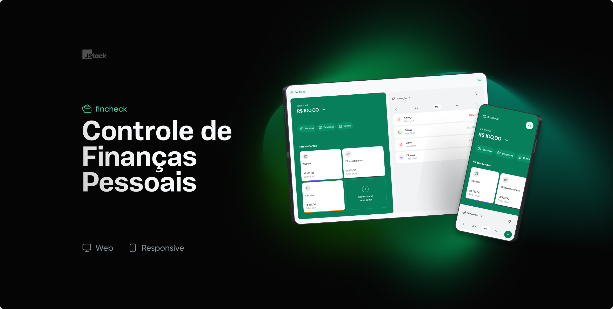

# <div align="center"></div>

Gerencie suas finanças pessoais de uma forma simples com o fincheck, e o melhor, totalmente de graça!



## 💡 Features
- Cadastro de contas bancárias
- Cadastro de despesas e receitas
- Associar gastos/despesas à contas bancárias
- Filtrar por data, categoria de gasto/despesa, banco e muito mais!

## 🛠️ Tecnologias Utilizadas

- Vite
- TypeScript
- ReactJS
- React Query
- Radix-UI
- Zod
- Axios
- React Hook Form
- React Router Dom
- Tailwind CSS

## 📋 Pré-requisitos
- Certifique-se de ter o [Node.js](https://nodejs.org/) instalado em seu sistema. Este projeto foi testado com a versão 18.17.1 do Node.js.
- Ter a [Api](https://github.com/pedrobadm7/api-fincheck) instalada e rodando em seu computador
- Sistemas operacionais compativeis: `Windows`, `Linux` e `Mac`

## 🔧 Instalação
Clone o repositório e execute os seguintes comandos:

```bash
# Clonar o repositório
git clone git@github.com:pedrobadm7/fincheck-web.git

# Entrar no diretório do projeto
cd seu-projeto

# Instalação de dependências
yarn install / npm install
```

## 🔧 Configuração
```env
VITE_API_URL=http:http://api.com
```


